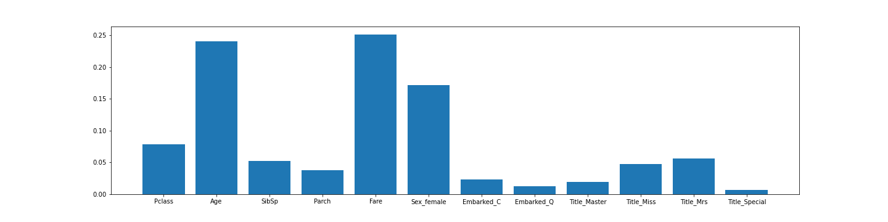
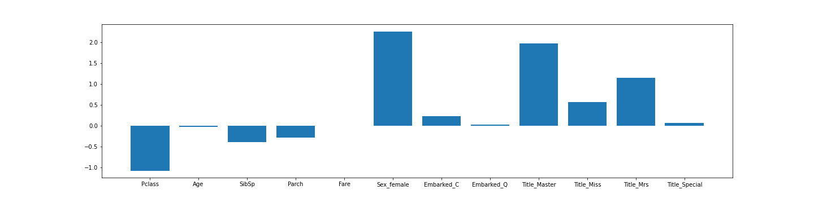

# Titanic Kaggle Analysis

An analysis of the Titanic sinking using ML models Random Forest and Logistic Regression to predict survivability factors.

**Here is a link to the [kaggle competition](https://www.kaggle.com/c/titanic).**

## The Data
Two datasets are available, the training data and the testing data. We first must go through the data and make the necessary cleaning process needed before creating any models. This includes filling null rows, dropping columns that contain too much null data, and splitting variables such as the name into first, last, and title columns.

## Machine Learning Models
Because there are categorical data columns such as gender, dummy columns were created so it can be fit into the model. First, the random forest classifier was used with an n_estimators of 700. The R-Squared score would fall around 80%. The importance of features is then graphed to see how each feature is weighted.

Next, a logistic regression model was used, and the R-squared would fall around 82%. Similarly to the random forest, the coefficients can be found for each variable to determine the affect on survivability.

## Analysis
It is very interesting how both of the models found different variables and features to affect the survival of the passengers. One feature that seemed to have an effect in both models were the gender/sex. It appears females had higher surivability and that could be caused by the common "ladies first" or "save women and children first" ideologies.

## Resources, Libraries, & Tools
[SciKitLearn](https://scikit-learn.org/stable/)
[Matplotlib](https://matplotlib.org/)