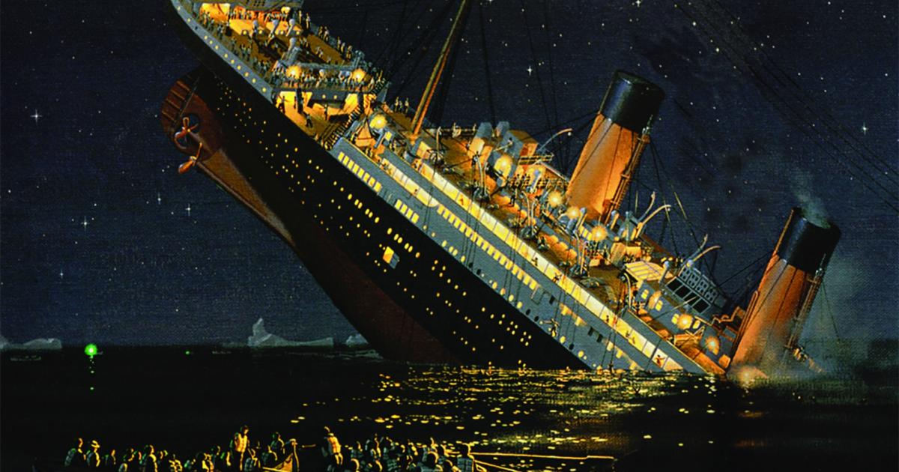

# Titanic Kaggle Analysis

An analysis of the Titanic sinking using ML models Random Forest and Logistic Regression to predict survivability factors.

Here is a link to the [kaggle competition] (https://www.kaggle.com/c/titanic)

